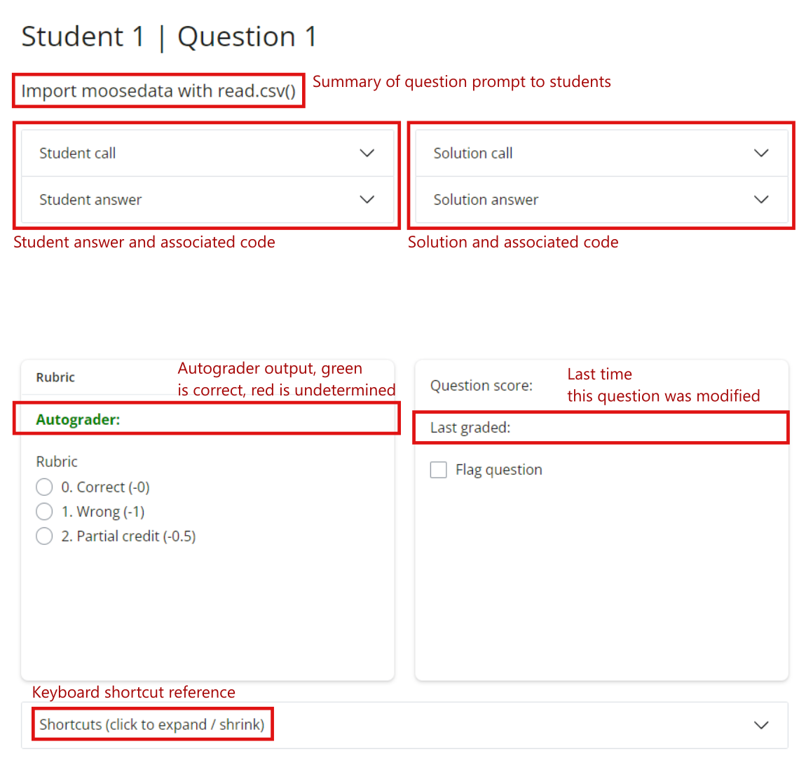

```{r setup, include=FALSE}
knitr::opts_chunk$set(echo = TRUE)
```

# BIOL 1001/1002 Grading Winter 2026

## Overview

This grading workflow makes use of two parts: (1) an autograding R script that attempts automatically grade assignment-based question and locates the specific calls the student used to produce the result, and (2) a shiny app to assist in standardized rubric-based grading of these assignments.

## Installation

Before running the grading app there are a few R packages that might need to be installed on your computer. These packages are:
    • dplyr
    • lubridate
    • bslib
    • shiny
    • shinyAce
    • shinyjs
    • shinyFeedback

You can run this code snippet that will check packages you have installed and only install the ones that are not:
```{r dependencies, eval=FALSE}
# Define your list of required packages 
packages <- c("dplyr", "lubridate", "bslib", "shiny", "shinyAce", 
              "shinyjs", "shinyFeedback")

# Identify packages not already installed 
new_packages <- packages[!(packages %in% installed.packages()[,"Package"])] 

# Install only the missing ones 
if(length(new_packages)) install.packages(new_packages) 
```

The installation simply requires unzipping the application package to a directory (folder) and running the shiny app with the function `runApp(appDir)` where `appDir` is the path to the inner gradeApp folder. If you run `setwd()` in the folder you unzipped to, `appDir` would be `“gradeApp/”`. And so to run the app you would first load the shiny package with `library(shiny)`, then type `runApp(appDir = "gradeApp/")`. Or without loading the library right away you can use `shiny::runApp(appDir = "gradeApp/")`.

The directory structure of the folder is as follows

```
gradingUI/  
|  
|—— 1002_solution.R (script used to generate answers.rda)  
|  
|—— data/  
|   |—— 1002_answers.rda (solution and correct code)  
|   |—— 1002_rubric.csv (grading rubric)  
|   ——— autograded.rda (autograding results)  
|  
——— gradeApp/  
    |—— global.R   
    |—— server.R  
    |—— ui.R    
    |—— www/  
    |   ——— Student assignments (All student assignments)  
    ——— R/  
        ——— cards.R
```
				 
				 
## Grading application

Sections with small arrows can be expanded and collapsed to focus on what is important. This includes a code editor on the left side of the app that changes automatically when the student you are grading is changed. This code editor is not as fully functional as I had hoped. The run selection button does work – you can select code and run it with that button. But it’s not very helpful without running dependent lines of code in the script which are hard to quickly identify. However, sometimes the autograder will fail to find the right lines where a student has answered a question so it can be helpful for that. It is also the easiest way to answer prose-type question answered in comments in the script.

In terms of the autograder output, as a general rule of thumb, when it has determined a correct answer (green text on the app) it is certainly correct. But when it’s determined to be wrong (red text) it has more odds of getting things wrong: missing a misspelling or picking the wrong line of code. So in general be cautious about those but feel free to move through the green autograded question fairly quickly.



## Exporting grades

As grading is completed on the app, progress is automatically saved to `gradelog.csv` which holds rows for each student and each question. The `student` and `question` columns track these with integer codes, as shown in the title of the shiny app as you navigate through students and questions. The other important column of the log is `rub` which holds the rubric key chosen for that question. Given the larger rubric csv file, those keys can be used to join points for these students and calculate an assignment grade.

Besides those essential columns there is also a column `last` that stores the last modified date and `flag` if the question has been flagged. There is also an unused column `mess` for feedback massages. Here is a simple example of what the `gradelog.csv` looks like for an assignment with 3 students and 5 questions omitting the unused `mess` column:

```{r gradelog, echo = FALSE}

# Make students and questions
student <- rep(1:3, each = 5)
question <- rep(1:5, times = 3)

# Make random rubric from 1 to 3
rub <- sample(0:3, length(student), replace = TRUE)

# Make last modified dates
last_sub <- sample(0:2000, length(rub), replace = TRUE)
last <- Sys.time() - last_sub

# Make flagged
flagged <- as.logical(sample(0:1, length(rub), replace = TRUE))

# Make dataframe
gradelog <- data.frame(student, question, rub, last, flagged)
head(gradelog)

```

Since the log is a simple csv with just a minimum of 3 columns: `student` (integer), `question` (integer), and `rub` (integer from within choices in larger `rubric.csv`). So, if this tool is not working for you and it ends up slowing you down you have the flexibility to move to a different preferred method as long as you can send me this log at the end of the day that I can combine with others.
